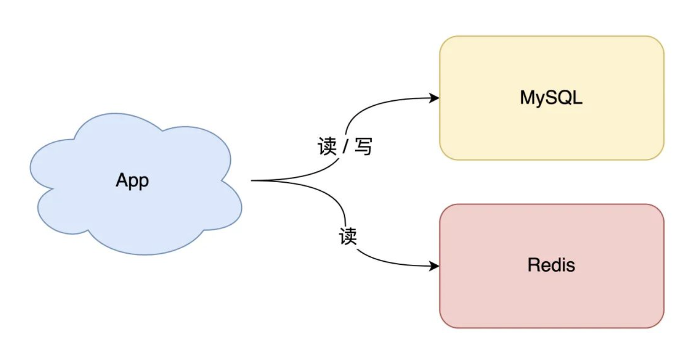
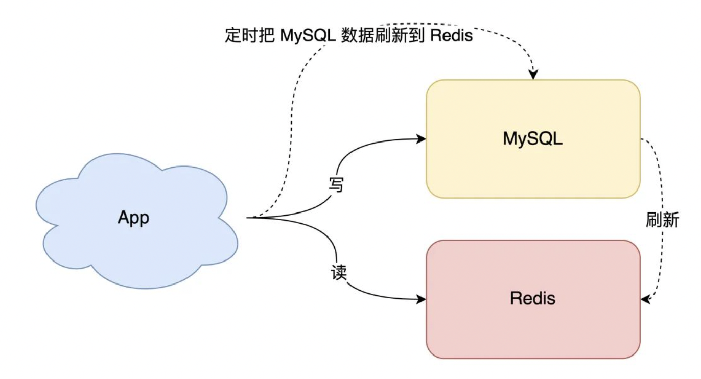
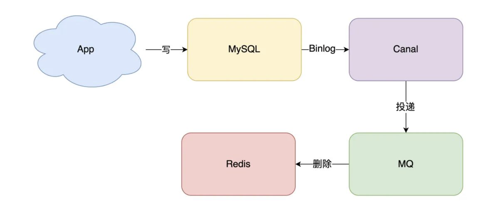

# cache
当单个 DB 遇到性能瓶颈的时候引入 cache 是最好的解决办法, 架构模型就变成了这样



但是怎么同步 DB 与 cache 的数据呢



这种方式有两个问题:
- 缓存利用率低：不经常访问的数据，还一直留在缓存中
- 数据不一致：因为是「定时」刷新缓存，缓存和数据库存在不一致（取决于定时任务的执行频率）

## 一. 提高利用率
很容易想到的方案是，缓存中只保留最近访问的「热数据」

- 写请求依旧只写数据库
- 读请求先读缓存，如果缓存不存在，则从数据库读取，并重建缓存
- 同时，写入缓存中的数据，都设置失效时间

## 二. 数据一致性问题
当数据发生更新时，我们不仅要操作数据库，还要一并操作缓存。具体操作就是，修改一条数据时，不仅要更新数据库，也要连带缓存一起更新

- 先更新缓存，后更新数据库
- 先更新数据库，后更新缓存

秉承数据一定先落库的原则, 第二种方式更妥当, 但是无论谁先谁后，但凡后者发生异常，就会对业务造成影响(两步操作不具有原子性)

### 2.1 并发问题
如果采用 「 更新策略 」,在并发场景下一定会出现问题, 例如:
````
有线程 A 和线程 B 两个线程，需要更新「同一条」数据，会发生这样的场景

线程 A 更新数据库（X = 1）
线程 B 更新数据库（X = 2）
线程 B 更新缓存 （X = 2）
线程 A 更新缓存 （X = 1）
最终 X 的值在缓存中是 1，在数据库中是 2，发生不一致。
````

> #### 所以此时我们需要考虑另外一种方案：删除缓存。

### 2.2 删除缓存保持数据一致性
- 先删除缓存，后更新数据库
- 先更新数据库，后删除缓存

经过分析下来, 第二种方式是可以保证数据一致性的。所以，我们应该采用这种方案，来操作数据库和缓存, `并发问题解决了`

### 2.3 DB + Cache 操作的一致性问题
#### 2.3.1 使用消息队列
一般我们对操作失败的过程都采用 「重试机制」, 那么重试涉及到到底是 「同步」还是 「异步」重试呢, 对于业务场景并发度不高, 对于用户提要要求没那么极致的场景可以采用 同步重试, 那么对于并发度很高的场景, `采用异步更为合适, 是把重试请求写到「消息队列」中，然后由专门的消费者来重试，直到成功`

那么交由消息队列就有了新问题, `「消息队列」消费失败了怎么办`, 为此就要做到一下几点
- 消息队列保证可靠性：写到队列中的消息，成功消费之前不会丢失（重启项目也不担心）
- 消息队列保证消息成功投递：下游从队列拉取消息，成功消费后才会删除消息，否则还会继续投递消息给消费者（符合我们重试的场景）


#### 2.3.2 订阅 DB 的 binlog 日志变化
当一条数据发生修改时，MySQL 就会产生一条变更日志（Binlog），我们可以订阅这个日志，拿到具体操作的数据，然后再根据这条数据，去删除对应的缓存



当然，我们需要投入精力去维护 canal 的高可用和稳定性。


> #### 想要保证数据库和缓存一致性，推荐采用「先更新数据库，再删除缓存」方案，并配合「消息队列」或「订阅变更日志」的方式来做

# 方案决断

## 歌华

- 背景

> 歌华: 需要提供接口承载 10 万 并发, 数据实时性要求不高, 但是确保每次请求一定要获取到数据

- 技术选型

> mysql + redis + lua + local cache


# 分布式锁
- redis + lua (我们选用)

- etcd

````
为了简化分布式锁、分布式选举、分布式事务的实现，etcd社区提供了一个名为concurrency的包来帮助我们更简单、正确的使用分布式锁。它的实现非常简单，主要流程如下：

首先通过concurrency.NewSession方法创建Session，本质上是创建了一个TTL为10的Lease
得到Session对象后，通过concurrency.NewMutex创建一个mutex对象，包括了Lease、key prefix等信息
然后听过mutex对象的Lock方法尝试获取锁
最后通过mutex对象的Unlock方法释放锁
````