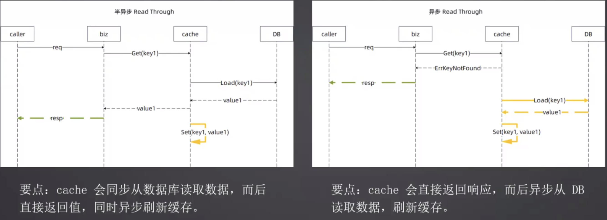

# 缓存模式

常用的缓存模式
- cache-aside
- read-through
- write-through
- write-back
- refresh-ahead

## cache-aside
把 Cache 当成一个普通的数据源，更新 Cache 和 DB 都依赖于开发者自己的代码逻辑

业务代码可以做决策：
- 未命中的时候是否要从 DB 取数据，如果不从 DB 取，可以考虑使用默认值进行业务处理
- 同步 or 异步读取数据并且写入
- 采用 singleflight

### 同步场景

### 异步 & 半异步场景

存在的并发问题:

## read-through

业务代码只需要从 cache 中读取数据，cache 会在缓存不命中的时候去读取数据

写数据的时候，业务代码需要自己写 DB 和写 cache

cache 可以做决策：

- 未命中的时候是否要从 DB 取数据。如果不从 DB取，可以考虑使用默认值进行业务处理
- 同步 or 异步读取数据并且写入
- 采用 singleflight

### 同步场景

### 异步 & 半异步场景

## write-through

开发者只需要写入 cache，cache 自己会更新数据库在读未命中缓存的情况下，开发者需要自己去数据库捞数据，然后更新缓存（此时缓存不需要更新 DB 了）

cache 可以做决策：

- 同步 or 异步写数据到 DB，或者到 cache
- cache 可以自由决定先写 DB 还是先写 cache，一般是先写 DB

### 同步场景

### 异步 & 半异步场景

## write-back

在写操作的时候写了缓存直接返回，不会直接更新数据库，读也是直接读缓存

在缓存过期的时候，将缓存写回去数据库

优缺点：

- 所有 goroutine 都是读写缓存，不存在一致性的问题 (如果是本地缓存依旧会有问题)
- 数据可能丢失：如果在缓存过期刷新到数据库之前，缓存宕机，那么会丢失数据

write-back 主要是利用 callBack 回调，在里面将数据刷新到 DB 里。

## refresh-ahead

refresh-ahead 依赖于 CDC (changed data capture) 接口：

- 数据库暴露数据变更接口
- cache 或者第四方在监听到数据变更之后自动更新数据
- 如果读 cache 未命中，依旧要刷新缓存的话，依然会出现并发问题

这就是我们常说的:  **mysql + canal + kafaka + redis** 的组合

# 常见缓存问题

- 穿透
- 击穿
- 雪崩

## 缓存穿透：

读请求对应的数据根本不存在，因此每次都会发起数据库查询。数据库返回 NULL，所以下一次请求依旧
会打到数据库。**关键点就是这个数据根本没有，所以不会回写缓存**。

### 解决方案：

- 使用 singleflight 能够缓解问题。但如果攻击者是构造了大量不同的不存在的 key，那么 singleflight 的效果并不是很好
- 知道数据库里面根本没有数据，缓存未命中就直接返回
  - 缓存里面是全量数据，那么末命中就可以直接返回
  - 使用布隆过滤器、bit array 等结构，未命中的时候再问一下这
    些结构
- 缓存没有，但是依旧不会去数据库查询，而是使用默认值
- 在缓存未命中回表查询的时候，加上限流器

## 缓存击穿：

缓存中没有对应 key 的数据。

一般情况下，某个 key 缓存未命中并不会导致严重问题。但是如果该 key 的访问量非常大，大家都去
数据库查询数据，那么就可能压垮数据库。

击穿和穿透比起来，关键在于 **击穿本身数据在 DB 里面是有的**，只是缓存里面没有而已，所以只要回写到
缓存，此一次访问就是命中缓存。

### 解决方案：

- singleflight 就足以解决问题
- 缓存未命中的时候，使用默认值
- 在回查数据库的时候，加上限流器，不过这个是保护系统，而不是解决问题

## 缓存雪崩：

同一时刻，大量 key 过期，查询都要回查数据库。常见场景是在启动的时候加载缓存，因为所有 key的过期时间都一样，所以会在同一时间全部过期。

### 解决办法

- 在设置 key 过期时间的时候，加上一个随机的偏移量

## 重点问题

- 什么是缓存穿透、雪崩、击穿？如何解决？在实践中，大多数时候，你可以采用装饰器模式无侵入式地解决这些问题。
- 缓存模式有哪些？read-through、 write-through、 cache-aside、 write back。要记住这些缓存模式的特
  征。类似地，缓存模式也可以采用装饰器模式来实现。另外要注意，这些模式都有不同的变种，也就是我们
  讨论的异步、半异步之类的，要注意这些变种的优缺点。
- 缓存穿透、雪崩、击穿和缓存模式的关系？没有关系。具体来说，穿透、雪崩、击穿是描述缓存使用不当，而缓存模式则是如何组织缓存和数据的设计模式。
-  什么是 singleflight？有什么好处（缺点）？基本上 singleflight 就是用来控制某个资源只有一个 goroutine
  访问。对于 singletlight 来说，它需要的内存和 key 数量成正比，而且只能控制单进程内的 goroutine.
- 为什么不支持全局的（分布式的）singleflight？ 要做全局的 singleflight，本质上就是分布式锁，性能影响
  太大了。而且一般来说如果在单机,上使用了 singleflight，数据库还是扛不住压力，那么说明数据库本身需要
  扩容了。
- 缓存模式能不能解决缓存一致性问题？不能
- write-back 有什么优缺点？优点是类似于 Redis 之类的缓存，一致性问题要轻微一点，因为用户读写都
  是访问缓存，虽然缓存数据和数据库数据不一致，但是用户没有感知。最大的缺点就是可能永久丢失数
  据，即突然宕机时来不及将缓存刷回去数据库
